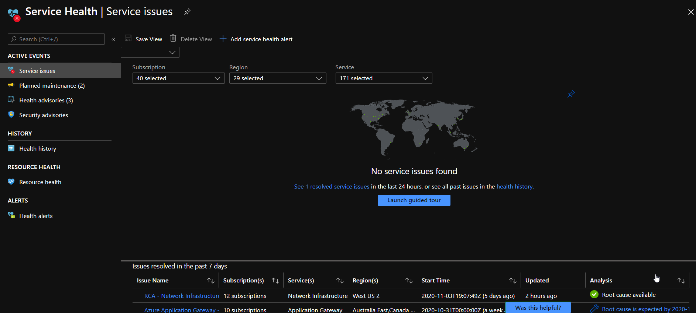
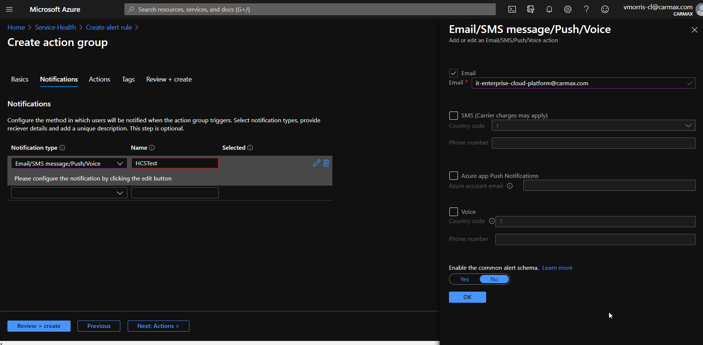

# Proposed Monitor and Alerting Strategy
This is the proposed new standard for monitoring and alerting HCS managed azure resources. This document is 
subject to change at any time and will be modified as more members review and tweak the proposed plan

The goal of this guide is to establish a standard baseline that effects all devices a

## Policies
Policies are a great tool when it is necessary to enforce a strategy across the board when it comes to the monitoring and alerting strategy. Azure policy will allow us to actually enforce certain monitoring and alerting standards described in this documentation.With the use of azure policy we can turn these recommendations into requirements when developers deploy new resources

A great example of this is policy can be used to enforce Azure monitor for VMs is enabled. This will force a vm to have this setup upon creation ensuring the monitoring capabilities are there. [See Here](https://docs.microsoft.com/en-us/azure/azure-monitor/insights/vminsights-enable-policy)

Note: Policy will mostly be used for HCS managed resources, we dont want to enforce policies on subscriptions using the NSM as we want our customers to have the freedom to maske their own decisions on monitoring and alerting, like everything else. 

## Service Health

The service health feature of microsoft is a single location That provides a collection of useful information via alerts such as

**Planned Maintenance -** Alerts generated by Microsoft for future maintenance they are planning that may affect our resources in question

**Health Advisories -** Alerts generated by Microsoft for compliance issues in our environment that may cause performance issues or security risks

**Service Issues -** Microsoft outages that could be affecting our services

**Security Advisories -** Alerts generated by Microsoft to communicate urgent security related information affecting our resources. 

Currently we only have this alerting setup in the following subscriptions:
* IT Operations Prod Subscription
* Infrastructure Shared Non Production Subscription
* Infrastructure Shared Production Subscription
* PII Non Production Subscription

The HCS team should consider setting these alerts up for all subscriptions to notify to our team. Having information on when compliance is not met as per microsofts standards, when critical outages occur, and any form of security risk microsoft identifies appears to be imperative and should be instantly notified. 

 In addition we should provide optional alerting for teams utilizing the NSM. We can have these alerts sent via email/sms which allows us to easily integrate with teams or pager duty. It is highly recommended for teams to request this setup so they can stay up to date on current azure problems/changes/recommendations

Quick searches have found it should be fairly simple to automate the creation of these service alerts. [See here](https://thomasthornton.cloud/2019/07/18/creating-azure-service-health-alerts-in-powershell/)

## Resource Level Monitoring

### Activity Logging Across the board
Activity logging is an important component of monitoring. It allows teams to identify and review all changes made to resources with using the built in logging service Microsoft supplies. The proposal is to turn on subscription level activity logs and point them to the existing eventhub in the subscription as part of the splunk eventhub architecture. This is a very simple change and can be turned on at each subscription within minutes. It is also possible to automate this with future deployments using arm templates. This will provide great benefit in terms of auditing and quickly identifying accidently deletions/creations of resources. This data may also be helpful in tracking malicious activity. 

### App Service Monitoring
There are numerous methods of monitoring app services. The best first step is to enable application insights on the appservice. This can be done either by turning on "Agent-based application monitoring" or by leveraging the application insights SDK in the code of the app service to start collecting logging/performance metrics. Microsoft has put a pretty extensive guide together on how to setup application insights [here](https://docs.microsoft.com/en-us/azure/azure-monitor/app/azure-web-apps?tabs=net) It shows you how to enable this in the portal or setup app insights via code. Going off of best devops practices the official reccomendation is for teams to integrate the SDKs in their code on deployment, this will simplify the deployment process, and allow for more customization. 

Once App insights is enabled on the app service App Insights will be able to review health performance, and usage information. Azure monitor can then be used to generate alerts based on information collected. 

As per Microsoft we can monitor the following with app insights on app services

* Request rates, response times, and failure rates - Find out which pages are most popular, at what times of day, and where your users are. See which pages perform best. If your response times and failure rates go high when there are more requests, then perhaps you have a resourcing problem.

* Dependency rates, response times, and failure rates - Find out whether external services are slowing you down.

* Exceptions - Analyze the aggregated statistics, or pick specific instances and drill into the stack trace and related requests. Both server and browser exceptions are reported.

* Page views and load performance - reported by your users' browsers.

* AJAX calls from web pages - rates, response times, and failure rates.

* User and session counts.

* Performance counters from your Windows or Linux server machines, such as CPU, memory, and network usage.

* Host diagnostics from Docker or Azure.

* Diagnostic trace logs from your app - so that you can correlate trace events with requests.

* Custom events and metrics that you write yourself in the client or server code, to track business events

See More info [here](https://docs.microsoft.com/en-us/azure/azure-monitor/app/app-insights-overview)

> Ideally we could get all of this data into splunk and leverage the ITSI offering to do anomaly detection. For example the failure rates of 2 applications may differ but having the historical data in splunk would allow us to make decisions by the average failure rates on what to report on to generate more valuable alerts. However we are not yet at this point with splunk, and our splunk capabilities.

For the time being HCS should do the following.

1. Create a policy to ensure appinsights is setup on all app services

2. Create standard performance alerts for all app services via automation to detect and alert on the following:
| Metric    | Alert Trigger |
|------------------------|---------------|
| Disk Space Utilization | 90% or higher |
| Availability | is the service online or offline |
### Cache monitoring
It is recomended to ensure metrics are enabled on any cache services in azure. Beyond this there is not much else to monitor. Events can also be streamed to eventhubs for splunk integration. Specific alerts can be created for things such as cachemisses, or serverload percent but this will most likely generate more false positives. 

The official HCS recommendation  for caches should be to simply ensure app insights is enabled for the queue and that will suffice.  

### Cosmos DB monitoring
By Default Azure monitor collects metrics for cosmos DB which offer lots of valuable information such as available storage, total number of files, total requests etc. For information on how to view this see [here](https://docs.microsoft.com/en-us/azure/cosmos-db/monitor-cosmos-db#monitor-cosmosdb)

Beyond this HCS recommends setting up an alert to notify you when the service unavailable and when AvailableStorage is less than 10% of the quoted space. There are both metrics built into azure monitor for this however alerts will need to be setup for this. For additional information on the available metrics for CosmosDB see [here](https://docs.microsoft.com/en-us/azure/cosmos-db/monitor-cosmos-db-reference)

### Function App Monitoring
Function apps are a little unique when it comes to monitoring and alerting because as of version 2.x the application insights for a function app will automatically ingest data from dependencies binded to the function such as cosmos db, eventhubs, services buses, and storage accounts. This means these services will automatically be monitored by the function app if they are bounded which is great for troubleshooting incidents. 

Therefore the official recommendation from HCS for Function apps is to simply enable application insights, then setup alerts for availability, and ensure alerts are setup for any dependencies with storage requirements to alert on less than 10% available storage. 

For more on monitoring Function apps see [here](https://docs.microsoft.com/en-us/azure/azure-functions/functions-monitoring)

### KeyVault Monitoring
There are numerous built in metrics available for keyvaults which can be turned on quite easily. Some of the notable ones which should be turned on across the board 

* Vault Availability
* Vault Saturation
* Service API Latency

At the least Teams should monitor the availability of keyvaults with azure monitor.

### Storage Account monitoring
For storage accounts by default monitoring is turned off so HCS does recommended enabling this. Teams will need to setup a retention policy for the data that works for them. It is recommended to make the threshold at least 7 days. There are numerous useful metrics that can be pulled from this once enabled, but HCS at the minimum reccomends simply enabling logging/metrics in the first place via the portal, and then creating an alert for monitoring availability. For more information see [here](https://docs.microsoft.com/en-us/azure/storage/common/storage-monitoring-diagnosing-troubleshooting?tabs=dotnet)

### Traffic Manager Monitoring 
See [Here](https://docs.microsoft.com/en-us/azure/traffic-manager/traffic-manager-monitoring)

### VM level Monitoring
Depending on the host operating system the VM requirements will be different. The following bare minimum should be on both

1. CrowdStrike should be on both Linux and Windows VMs to provide monitoring and alerting for any form of malicious software that may compromise a vpn
2. The standard Performance monitoring should be in place:
| Metric    | Alert Trigger |
|------------------------|---------------|
| Availability      | Is the VM online or not |
| Disk Space Utilization | 90% or higher |
3. Activity logging should be covered as previously mentioned via the subscription level
4. Uptime Status monitoring
5. A connection to Log analytics is setup and working 

#### Specifics For Windows VMs

* Event viewer logs should be ported to Log analytics for additional monitoring capabilities. These could then be sent to splunk or app insights

#### Specifics For Linux VMs

* Syslog should be sent to Log analytics

#### Global administrators
We should create an automated report that comes out on a bi weekly bassis with a list of all Global Admin accounts. Additionally we should generate an alert every time a new account is created. 