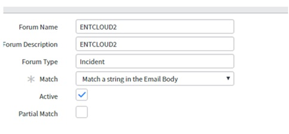
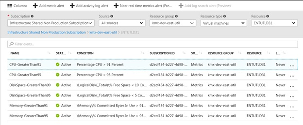
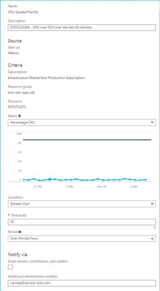

# VM Alerting to ServiceNow

Our current strategy for monitoring and alerting of Azure resources is to utilize email which will generate a ticket into ServiceNow.

We are currently taking advantage of the built in Azure monitoring which allows for emails to be sent. These emails can then be sent into ServiceNow carmax@service-now.com.

There are two important components to this email alert.  First of all, the abbreviated ServiceNow group name must be known and this name must be used within the alert that is sent from Azure.  For the Enterprise Cloud team, our name is ‘ENTCLOUD’. The priority number is added to the end of the name to designate the ServiceNow ticket priority.  For example, for a priority 2 ticket, the name ENTCLOUD2 would need to be used in the alert.

Secondly, a request needs to be made to the ServiceNow team to allow ticket creation when the abbreviated ServiceNow group name is found in the body of the email.  Below is an example of what this policy looks like within ServiceNow.

When configuring the alerts within Azure, this action can be done either through the portal or through PowerShell.
Below is an example from the Azure portal of what this alert will look like once created.

