# VM Heartbeat Alerts using Log Analytics

The goal of this document is to explain how to setup heartbeat (up/down) alerting for VMs in Azure.  A couple of pre-requisites must be in place before using this method.  First, the OMS portal needs to be deployed with Log Analytics enabled. Second, the VM needs to have the OMS agent loaded and must be able to communicate to OMS through an outbound internet connection.  This connection can go through the OMS Gateway if needed.  See OMS Gateway document for details on configuring that if needed.

1.	Login to the Azure portal.
[https://portal.azure.com](https://portal.azure.com)

2.	Search for Log Analytics

* For NonProd, select the “kmx-nonprod-shared” Log Analytics resource.

* For Prod, select the “kmx-prod-shared” Log Analytics resource.

* These Log Analytics resources are found in the Infrastructure Shared subscriptions.

3.	Select Log Search:

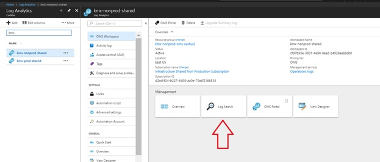

4.	Within the search query, type the following search string:

    `Heartbeat | where (Computer=~"SERVERNAME.KMX.LOCAL")
    | summarize max(TimeGenerated) by Computer, SourceComputerId, OSType
    `

5.	Click Run
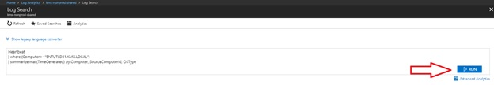

6.	Select New Alert Rule
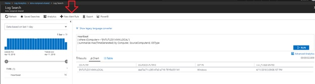

7.	Under the Create rule blade, select Alert criteria.

8.	Enter 1 for the Threshold in the Alert logic section.
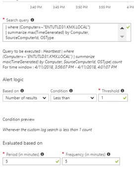

9.	Click Done

10.	Select Define alert details > Fill in the Alert rule name, Description, and Severity
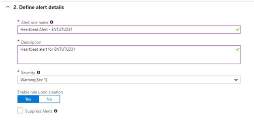

11.	Select Define action group > Click “Select action group” or “+ New action group” if a new action group is needed.

* Below is an example of the information that is needed for the action group.

* If you need to create a ticket within ServiceNow, you can use the “ServiceNow-InboundEmail” action group.
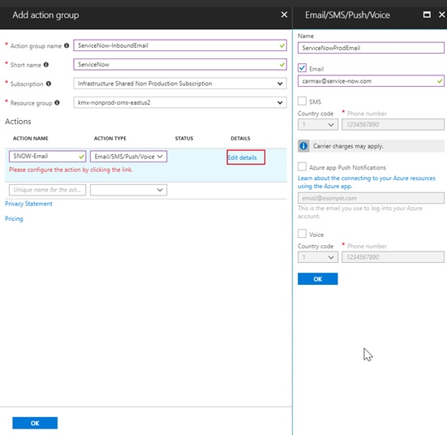

* Multiple actions can be configured within a single action group including email, SMS azure push notifications, a voice call, webhook, or even an automation runbook.
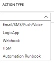

12.	Select Email subject under Customize Actions.
* If you are planning on automatically assigning the ticket to a particular group within Service Now, then the subject line needs to be updated with the ServiceNow group name.

* See below for an example.
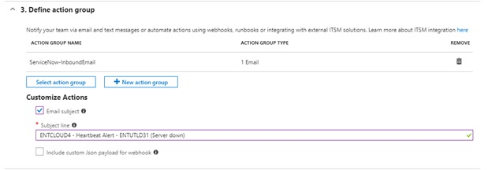

13.	Once finished with the rule creation steps, click “Create alert rule”.

14.	To verify that the rule created successfully, go to the Alerts blade within Log Analytics.

* The new rule will be listed as you can see from the below example.
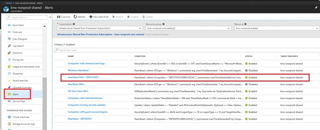

15.	These alerts will also show up in the OMS portal as well.
* Login to OMS portal:

     * Prod = [https://kmx-prod-shared.portal.mms.microsoft.com](https://kmx-prod-shared.portal.mms.microsoft.com)
     * NonProd = [https://kmx-nonprod-shared.portal.mms.microsoft.com](https://kmx-nonprod-shared.portal.mms.microsoft.com)

* Click the gear in the upper right corner of the screen.

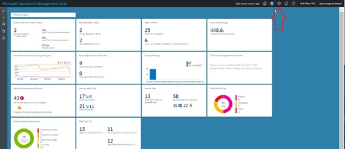

* Click Alerts on the left-hand menu.  This will show all of the alerts that have been configured including the newest alert that was recently setup.

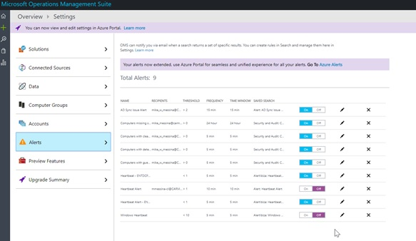

16.	This same process can be used for other alerts that utilize Log Analytics queries.  Below are some additional reference links to gain additional knowledge on using this query language.

* [https://docs.microsoft.com/en-us/azure/log-analytics/log-analytics-log-search](https://docs.microsoft.com/en-us/azure/log-analytics/log-analytics-log-search)
* [https://docs.microsoft.com/en-us/azure/log-analytics/log-analytics-log-search-transition](https://docs.microsoft.com/en-us/azure/log-analytics/log-analytics-log-search-transition)
* [https://docs.loganalytics.io/index](https://docs.loganalytics.io/index)
* [https://docs.loganalytics.io/docs/Learn](https://docs.loganalytics.io/docs/Learn)
