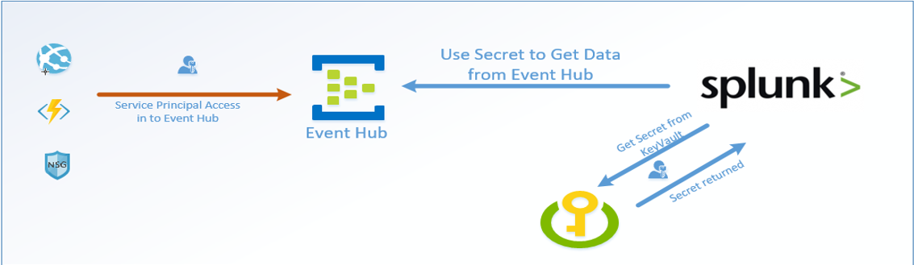
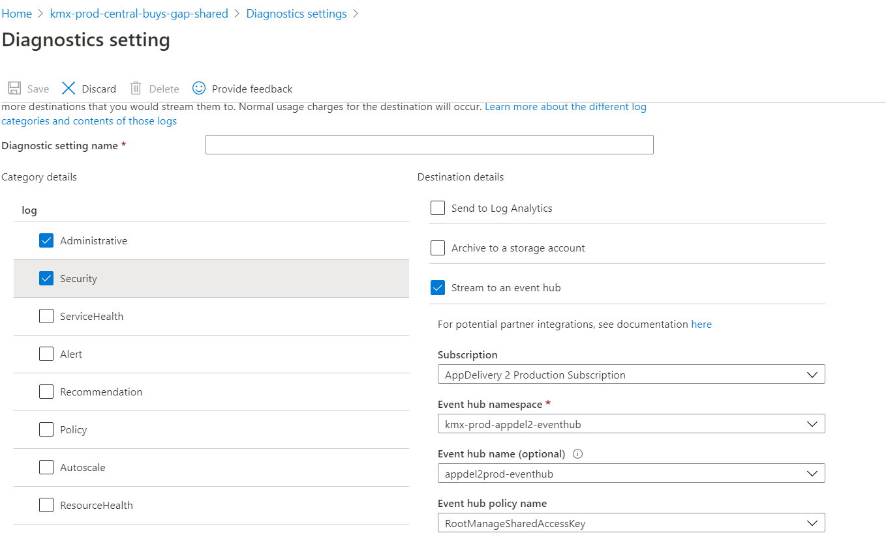

## Architecture and Design
The intention of this design was to place a resource group in every single managed subscription that contained one eventhub namespace, an event hub, and a shared access policy to allow splunk to connect. 

| Eventhub Name Space              | Region  | Resource Group name                         | Subscription                                      |
|----------------------------------|---------|---------------------------------------------|---------------------------------------------------|
| kmx-nonprod-appdel1-eventhub     | East US | kmx-nonprod-east-appdel1-splunkeventhub     | AppDelivery 1 Non Production Subscription         |
| kmx-nonprod-appdel2-eventhub     | East US | kmx-nonprod-east-appdel2-splunkeventhub     | AppDelivery 2 Non Production Subscription         |
| kmx-nonprod-appshared-eventhub   | East US | kmx-nonprod-east-appshared-splunkeventhub   | Application Shared Non Production Subscription    |
| kmx-nonprod-caf-eventhub         | East US | kmx-nonprod-east-caf-splunkeventhub         | CAF Non Production Subscription                   |
| kmx-nonprod-everest-eventhub     | East US | kmx-nonprod-east-everest-splunkeventhub     | Everest Non production Subscription               |
| kmx-nonprod-infosec-eventhub     | East US | kmx-nonprod-east-infosec-splunkeventhub     | Information Security Non Production Subscription  |
| kmx-nonprod-infrashared-eventhub | East US | kmx-nonprod-east-infrashared-splunkeventhub | Infrastructure Shared Non Production Subscription |
| kmx-nonprod-itops-eventhub       | East US | kmx-nonprod-east-itops-splunkeventhub       | IT Operations Non Production Subscription         |
| kmx-nonprod-offerhub-eventhub    | East US | kmx-nonprod-east-offerhub-splunkeventhub    | OfferHub Pilot Subscription                       |
| kmx-nonprod-pii-eventhub         | East US | kmx-nonprod-east-pii-splunkeventhub         | PII Non Production Subscription                   |
| kmx-nonprod-test1-eventhub       | East US | kmx-nonprod-east-test1-splunkeventhub       | Enterprise Cloud Platform TEST Subscription I     |
| kmx-nonprod-test2-eventhub       | East US | kmx-nonprod-east-test2-splunkeventhub       | Enterprise Cloud Platform TEST Subscription II    |
| kmx-prod-appdel1-eventhub        | East US | kmx-prod-east-appdel1-splunkeventhub        | AppDelivery 1 Production Subscription             |
| kmx-prod-appdel2-eventhub        | East US | kmx-prod-east-appdel2-splunkeventhub        | AppDelivery 2 Production Subscription             |
| kmx-prod-appshared-eventhub      | East US | kmx-prod-east-appshared-splunkeventhub      | Application Shared Production Subscription        |
| kmx-prod-caf-eventhub            | East US | kmx-prod-east-caf-splunkeventhub            | CAF Production Subscription                       |
| kmx-prod-infosec-eventhub        | East US | kmx-prod-east-infosec-splunkeventhub        | Information Security Prod Subscription            |
| kmx-prod-infrashared-eventhub    | East US | kmx-prod-east-infrashared-splunkeventhub    | Infrastructure Shared Production Subscription     |
| kmx-prod-itops-eventhub          | East US | kmx-prod-east-itops-splunkeventhub          | IT Operations Prod Subscription                   |
| kmx-prod-master-eventhub         | East US | kmx-prod-east-master-splunkeventhub         | CarMax Master                                     |
| kmx-prod-pii-eventhub            | East US | kmx-prod-east-pii-splunkeventhub            | PII Production Subscription                       |

## Deploying New Eventhubs
You need to use the following arm templates to deploy the required azure resources that create the backend of this solution 
here: https://github.carmax.com/CarMax/hco-azure-monitoring-alerting/tree/master/EventHub

### Setup your application for eventhub logging

The platform team has put together an excellent doccument for connecting your application to an eventhub through code [here](https://github.carmax.com/pages/CarMax/platform-reference/appinsights_eventhub.html)

Microsoft has also written an excellent guide on writing code that will send events to event hub which can be found [here](https://docs.microsoft.com/en-us/azure/event-hubs/event-hubs-dotnet-standard-getstarted-send)
(Remember once the data is in the eventhubthe splunk api will automatically ingest the events using its standard API call)

### Utilizing Connection Strings
Applications will require a connection string in order to connect to the eventhub and dump data. The current standard process is dev teams will reach out to HCS requesting the connection string for the eventhub name space they are trying to use and provide the HCS team an SPO they can use to provide access to the resource group the eventhub resides in. 

#### For Windows VMs
See [this](https://docs.microsoft.com/en-us/azure/azure-monitor/platform/diagnostics-extension-stream-event-hubs#troubleshoot-event-hubs-sinks) guide for sending windows VM diagnostics to eventhub
#### For Linux VMs
See [this](https://www.linkedin.com/pulse/how-send-syslog-messages-from-azure-linux-vms-eventhub-adrian-corona/) guide for sending Linux Vm diagnostics to eventhub

#### Sending Activity Logs to Eventhub
To send activity logs to to the event hubs, you will need to navigate to the resource group, or resource you wish to forward logs from then click **Activity Log >> Diagnostic Settings >> add diagnostics settings** then check *"Stream to an eventhub"** From here you will need to fill out the information for the eventhub you are trying to send data to and provide the policy name you are using (Usually the SendKey is the ideal policy) See image below

> Note, if you do not see the event hub as a drop down item, you will need to submit a request with HCS to validate you have read level access to the eventhub. 

See [this](https://docs.microsoft.com/en-us/azure/event-hubs/event-hubs-diagnostic-logs) guide for more info on sending activity logs to eventhub

## Searching in splunk for your data:

See all Azure data in splunk
>index="azure"

See all Azure eventhub data in splunk
>index="azure" sourcetype="Azure:eventhub"

See all Azure eventhub for a specific eventhub
>index=azure source="azure_event_hub://kmx_prod_master_eventhub