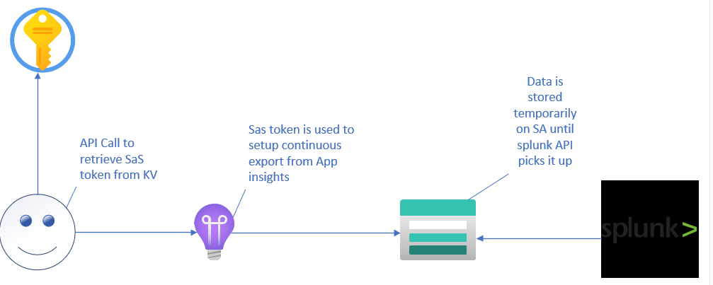
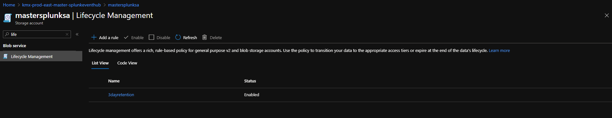
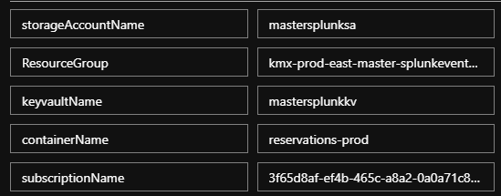
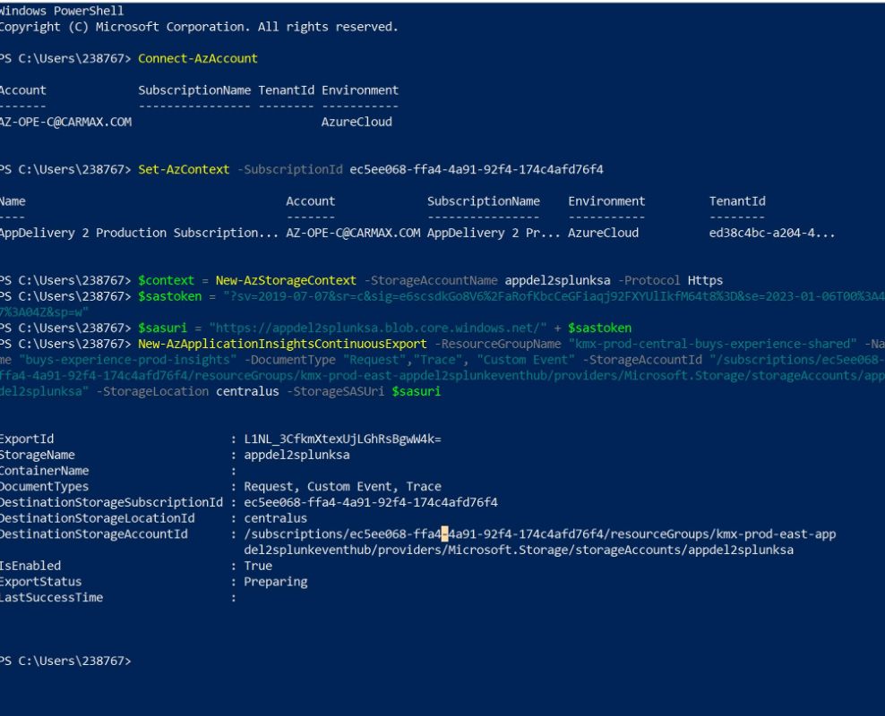
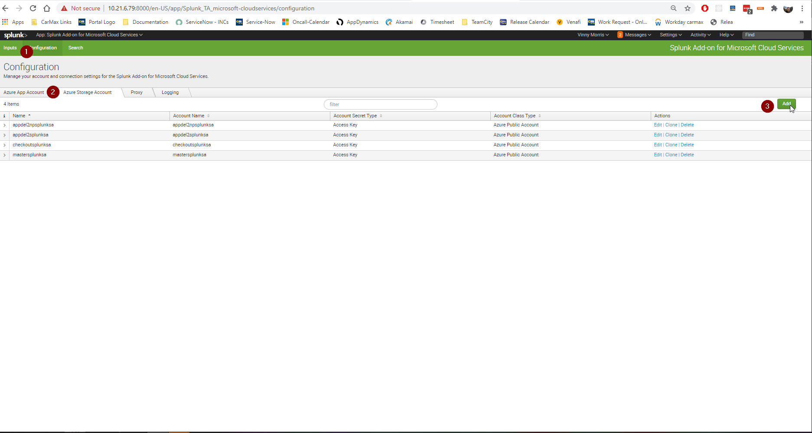
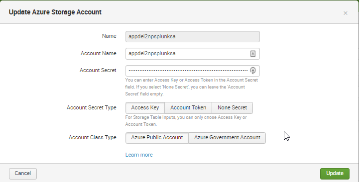
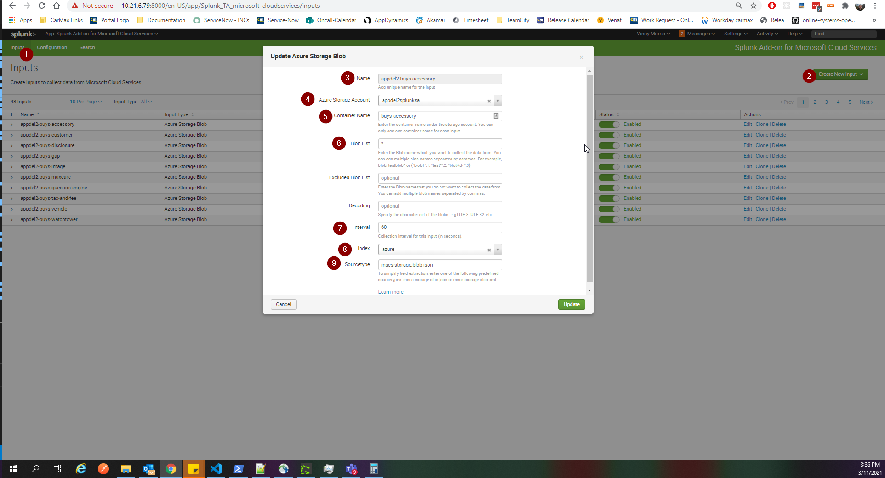

## Architecture and Design
The intention of this design was to place a resourcegroup in every single managed subscription that contains one storage account, one keyvault and a shared access policy to allow splunk to connect to said storage account via api call that leverages the SA's access key. Splunk will then read from each storage account defined in the portal and pull all information logged. Teams would have container generated for their application with a sas token that is stored in the keyvault for easy programatic retrieval. The idea was to separate users data in a secure fashion to provide a secure fault-tolerant solution.   

### Storage Account Retention Policy
The storage accounts are deployed with a baked in retention policy that removes data after 3 days. 3 days was chosen in the event Splunk had a temporary outage this would allow ample time for th service to be brought back on time, and all data to be properly ingested after the fact, while also keeping data storage costs down

> See arm template and search for "3dayretention" for more info on deployment:
> https://github.carmax.com/CarMax/hco-azure-monitoring-alerting/blob/master/StorageAccounts/storageaccount-template.json

Future state will be found here:
https://dev.azure.com/CarMax/Hcs-PublicCloud/_apps/hub/ms.vss-build-web.ci-designer-hub?pipelineId=1672&branch=master

## Naming Convention
When these resources where deployed to the shared subscriptions the existing splunk eventhub resource group was used to house the storage accounts as this infrastructure is meant to be a continuation of that effort. There is a gap in azure regarding which services can/cannot stream events to event hubs. The storage account infrastructure allows services such as app insights that cannot stream to an event hub to stream to the storage account, so it is considered the second half of the eventhub infrastructure. Respectively, this is the naming convention for the following components of the overall splunk azure ingestion:

Resource group name:
> kmx-environment-region-subscriptionshortname-splunkeventhub

Eventhub name:
> kmx-environment-subscriptionshortname-eventhub

Keyvault name:
> subscriptionshortnamesplunkkv

Storage Account name:
> subscriptionshortnamesplunksa

Container Name:
> application-enviornment

Keyvault Name:
> containerNamekey

## Deploying Storage Account environments
As of right now there are two templates that need to be ran to deploy a new storage account infrastructure.  the storage account and the keyvault. Eventually these will be put in an azure devops pipeline.

Until then the respective arm templates can be found here to deploy these resources:
https://github.carmax.com/CarMax/hco-azure-monitoring-alerting/blob/master/StorageAccounts/storageaccount-template.json

https://github.carmax.com/CarMax/hco-azure-monitoring-alerting/tree/master/KeyVault

> Note: It is imperative the SplunkSasContainer SPO is added as an contributor/keyvault secret officer to the RG these are housed in so the azure function that provisions containers can interact with them. 

> RBAC is enabled on the keyvaults so the storageaccount/key vault can properly interact. This association is created upon initial run of the container provisioning function. 

## Provisioning Containers/ Sas tokens
Due to the intricacy of this design and the multiple moving parts automating the provisioning of containers/sas tokens was imperative. This was initially built out in a powershell script to quickly provide this functionality to teams and get teams using the infrastructure as fast as possible. After some architectural discussions the plan changed from building an ADO pipeline for this to instead convert the powershell Script to an azure function.  The current function can be found [here](https://portal.azure.com/#blade/WebsitesExtension/FunctionMenuBlade/code/resourceId/%2Fsubscriptions%2Fff5066ec-4e18-4496-a391-f8202174140e%2FresourceGroups%2Fkmx-prod-east-hcs-splunksa-shared%2Fproviders%2FMicrosoft.Web%2Fsites%2FSplunkSAContainerManager%2Ffunctions%2FProvisionContainer)

At its current stage the script does the following:
1. Ensures the keyvault/storage account exist
2. Associates the keyvalt/Storage account to each other
3. Generates new container based on application name provided.
4. Generates as sas token with 2 year expiration and stores it to keyvault

Once the storage account and keyvault are deployed a user may request the creation of some containers. To provision them from the azure side, the following information is needed:

storageAccountName - The name of the storage account the container will live in
ResourceGroup - The resource group the storage account lives in
keyvaultName - The name of the keyvault where the sas token will be stored for the storage account
containerName - The name of the container the user has requested
subscriptionName - The name or subscription ID of the subscription all of the above lives in

To run the function click **"Code + Test"** in the left hand pane of the function, then select **"Test/Run"** at the top

Be sure to insert the proper variables before running, see the values above for reference

## Continuous Export with Sas token

# OPUX AppInsights/Splunk Continuous Export Setup

Use PowerShell to set up the continuous export for your AppInsights.

_The steps below are modified for prod accounts/ids; update names for QA_:
>Shoutout to Liza morrison for the following Guide on setting up Continious export! 

1. Connect to Azure account (cl account or Cyber Ark account for prod):

   `Connect-AzAccount`

2. Set the subscription id for the account (if needed):

   `Set-AzContext -SubscriptionId ec5ee068-ffa4-4a91-92f4-174c4afd76f4`

3. Set the storage account context:

   `$context = New-AzStorageContext -StorageAccountName appdel2splunksa -Protocol Https`

4. Set the SAS token:

   `$sastoken = ""`

   _Get the SAS token for your container in the storage account's key vault_

5. Set the SAS Uri:

   `$sasuri = "https://appdel2splunksa.blob.core.windows.net/op-experience" + $sastoken`

   _"op-experience" is the name of the storage account container_

6. Create the continuous export:

   `New-AzApplicationInsightsContinuousExport -ResourceGroupName "kmx-prod-central-buys-experience-shared" -Name "buys-experience-prod-insights" -DocumentType "Request","Trace", "Custom Event", "Dependency", "Exception", "Metric" -StorageAccountId "/subscriptions/ec5ee068-ffa4-4a91-92f4-174c4afd76f4/resourceGroups/kmx-prod-east-appdel2splunkeventhub/providers/Microsoft.Storage/storageAccounts/appdel2splunksa" -StorageLocation centralus -StorageSASUri $sasuri`

7. Check that the continuous export was set up successfully:

   `Get-AzApplicationInsightsContinuousExport -ResourceGroupName kmx-prod-central-buys-experience-shared -Name buys-experience-prod-insights`

### Splunk Searches

The base search to see all storage account traffic:

> index=azure sourcetype=mscs:storage:blob:json

To Drill down on your specific container use the following where "buys=experience-prod-insights" is your container name:

> index="azure" sourcetype=mscs:storage:blob:json source="buys-experience-prod-insights*"

Example Dashboard:

[OPUX Splunk Dashboard](https://search.splunk.carmax.org/en-US/app/search/opux)

### Splunk-Side Configuration

To setup the storage account infrastructure the first step is to define the storage account in the "Splunk Add on for Microsoft Cloud services app" To do this select the app from the home page, then select configuration >> Azure Storage Account >> Add

Then provide the access key for the storage account, and the storage account name. This will allow you to select the storage account in the next drop down. 

Once the storage account is created do the following to add a container.
1. Click inputs at the top
2. Select Create new input
3. Give the input a name "subscription-container"
4. Select the storage account
5. fil container name
6. Set blob list to *
7. set interval to 60
8. Set index to azure
9. set sourcetype to mcs:storage:blob:json
> its important to set it to blob:json as this corrects an issue with event formatting

